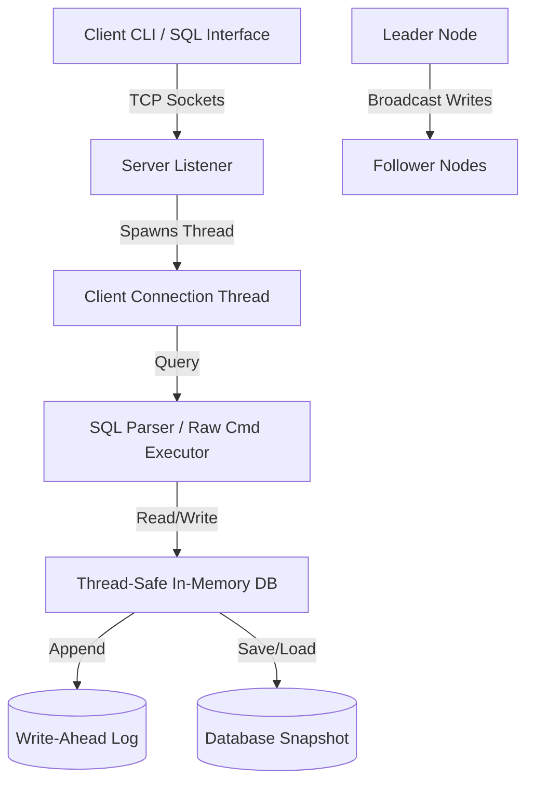

# Distributed Key-Value Database

A high-performance, multi-threaded, distributed in-memory key-value database written in **C++** from scratch. It features standard TCP socket communication (via Winsock2 on Windows), Write-Ahead Logging (WAL) for fault tolerance, snapshots for storage compaction, a replication simulation protocol for data consistency, and a custom SQL query parsing engine.

## 🚀 Key Features

*   **In-Memory Hash Index**: Average-case $O(1)$ read and write performance using `std::unordered_map`.
*   **Thread Safety**: High concurrency support using reader-writer synchronization via C++17 `std::shared_mutex` (multiple concurrent readers, exclusive writers).
*   **Write-Ahead Logging (WAL)**: Every write operation is logged to a write-ahead log file before modifying the memory state.
*   **Recovery and Snapshots**: Replays transactions on startup for crash recovery. Compacts logs by dumping memory snapshots to disk and truncating WAL logs.
*   **Distributed Replication**: Supports a Leader-Follower (Primary-Secondary) model:
    *   Followers register dynamically and perform complete state synchronization on startup.
    *   Writes processed on the Leader are replicated to Followers in real-time.
    *   Followers operate in read-only mode, rejecting direct client writes.
*   **Lightweight SQL Parser**: Allows standard SQL operations on top of a key-value structure:
    *   `SELECT value FROM kv WHERE key = 'username';`
    *   `SELECT * FROM kv;` (Prints keys and values in a formatted ASCII table)
    *   `INSERT INTO kv (key, value) VALUES ('username', 'alex');`
    *   `UPDATE kv SET value = 'alexander' WHERE key = 'username';`
    *   `DELETE FROM kv WHERE key = 'username';`

---

## 🏗️ Architecture



### Protocol Framing
To handle socket fragmentation and multi-line SQL tables, queries and replication events are formatted as single line-buffered strings terminated by `\n`. Client responses use an ASCII `\x04` (End-of-Transmission) control character as a terminator, enabling clients to read and display dynamic table matrices cleanly.

---

## 🛠️ Build and Compilation

### Prerequisites
*   Windows OS
*   `g++` compiler supporting C++20 or newer (e.g., via MSYS2 or MinGW-w64).
*   PowerShell (execution policy allowed).

### Compilation
Run the provided PowerShell build script to compile both the server and client binaries:
```powershell
.\build.ps1
```
This generates:
*   `server.exe`: The database server node.
*   `client.exe`: The interactive client shell.

---

## 🧪 Testing

We provide a comprehensive automated integration test suite that spins up a leader/follower cluster locally, validates the SQL/Raw KV engines, checks replication and write-rejections, and tests crash recovery.

Run the test suite via PowerShell:
```powershell
powershell -File .\test_database.ps1
```

---

## 🖥️ Usage Guide

### 1. Setting up a Local Cluster
Open separate terminal windows to run the Leader and Follower nodes:

**Terminal 1 (Start Leader Node):**
```powershell
.\server.exe --port 8000 --role leader --node-id node_leader
```

**Terminal 2 (Start Follower Node):**
```powershell
.\server.exe --port 8001 --role follower --leader-ip 127.0.0.1 --leader-port 8000 --node-id node_follower
```

### 2. Interacting via Client
Open a client terminal to run transactions:

**Terminal 3 (Connect Client to Leader):**
```powershell
.\client.exe --port 8000
```
Example session:
```sql
kv-db> INSERT INTO kv VALUES ('user:1', 'Alice');
Query OK, 1 row affected (INSERT).

kv-db> SELECT * FROM kv;
+--------+-------+
| key    | value |
+--------+-------+
| user:1 | Alice |
+--------+-------+
1 row(s) in set.

kv-db> UPDATE kv SET value = 'Alicia' WHERE key = 'user:1';
Query OK, 1 row affected (UPDATE).

kv-db> SNAPSHOT
OK
```

**Terminal 4 (Connect Client to Follower to verify read-only replication):**
```powershell
.\client.exe --port 8001
```
Example session:
```sql
kv-db> SELECT value FROM kv WHERE key = 'user:1';
+--------+--------+
| key    | value  |
+--------+--------+
| user:1 | Alicia |
+--------+--------+
1 row(s) in set.

kv-db> INSERT INTO kv VALUES ('user:2', 'Bob');
ERROR: Node is a Follower. Write operations are read-only.
```

---

## 📦 Pushing to GitHub

To publish this project to your GitHub:

1. Create a new repository on your GitHub account (do not initialize with README, license, or gitignore).
2. Open PowerShell in this project directory and run the following commands:
```powershell
# Initialize git and make first commit (local files are already set up)
git add .
git commit -m "Initial commit: Distributed Key-Value Database in C++"

# Rename main branch
git branch -M main

# Link your remote repository and push (Replace with your actual GitHub URL)
git remote add origin https://github.com/YOUR_GITHUB_USERNAME/YOUR_REPOSITORY_NAME.git
git push -u origin main
```
